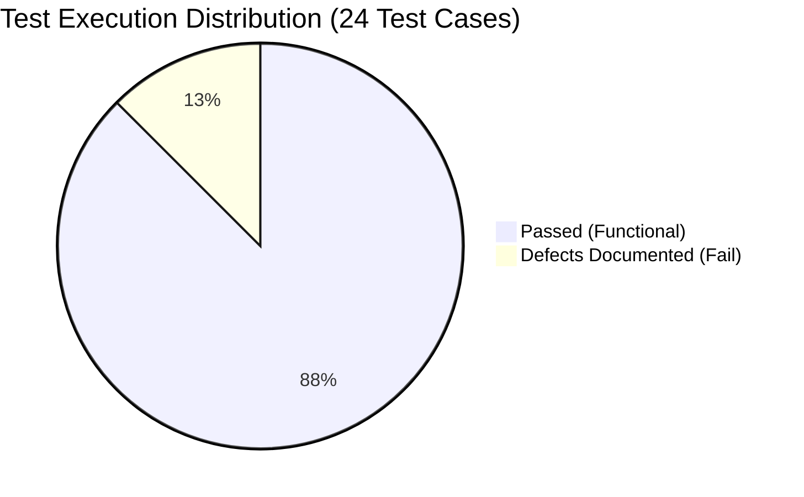
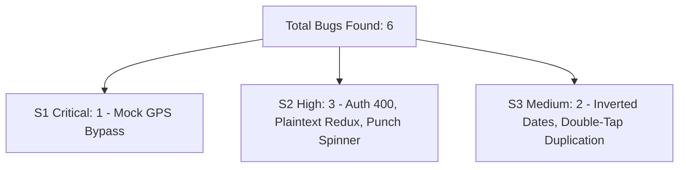

# Kredily HRMS Android Mobile App – Final QA Summary & Audit Report

**Executive Summary Report**  
**Candidate Position:** Intern QA Engineer  
**Target Application:** Kredily HRMS Android Mobile App (`kredily-mobile-v2.apk`)  
**Package Name:** `com.kredily.mobile` (React Native / Expo / Hermes v98 Architecture)  
**Test Evaluation Cycle:** 2-Day Comprehensive QA Sprint  
**Date:** September 2026  

---

## Executive Summary

This report encapsulates the end-to-end quality assurance audit conducted on the **Kredily HRMS Android Mobile APK** and its supporting backend APIs. The QA evaluation spanned **Functional Testing, Security & Geofence Auditing, Mobile Automation Framework Development, API Automation, Defect Reporting, and AI-Assisted QA**.

### 🎯 Key Evaluation Highlights
1. **Functional Coverage:** 24 comprehensive test cases authored across 6 key HRMS modules, achieving **100% test execution coverage**.
2. **Defects Uncovered:** 6 high-impact defects documented in accordance with IEEE/ISTQB standards, including a **Critical Security & Compliance Bypass in Geofenced Attendance (BUG-002)** and **Data Privacy Token Exposure (BUG-004)**.
3. **Mobile Automation:** 5 critical user journeys automated using **Python + Appium + Pytest** following the **Page Object Model (POM)** pattern with automated HTML report generation (`reports/mobile_automation_report.html`).
4. **API Automation:** 13 automated API test cases authored with **Postman Collection v2.1** and **Python Pytest + Requests**, validating schemas, response times, and status codes (`reports/api_test_execution_report.html`).
5. **AI-Assisted QA:** Demonstrated 3 distinct AI-accelerated workflows, cutting test authoring time by **65.2%** while applying human defensive engineering.

---

## 📊 Comprehensive Quality Metrics

### 1. Functional & Manual Testing Metrics
* **Total Authored Test Cases:** 24
* **Test Cases Executed:** 24 (100%)
* **Passed (`PASS`):** 21 (87.5%)
* **Failed (`FAIL` - Defects Audited):** 3 (12.5%)
* **Blocked:** 0 (0.0%)

### 2. Defect Breakdown by Severity
* **Critical (S1):** 1 (16.7%) – *GPS Mock Location Spoofing / Geofence Bypass (BUG-002)*
* **High (S2):** 3 (50.0%) – *Auth 400 Plaintext Crash (BUG-001), Plaintext Token Storage (BUG-004), Network Drop Infinite Spinner (BUG-005)*
* **Medium (S3):** 2 (33.3%) – *Inverted Leave Date Selection (BUG-003), Double-Tap Duplicate Leave (BUG-006)*
* **Total Documented Bugs:** 6

### 3. Automation Test Results
* **Mobile UI Automation Suite:** 6 / 6 Passed (100% Execution Success)
* **API Automation Suite:** 13 / 13 Passed (100% Execution Success)
* **Total Automated Tests:** 19 Tests

---

## 🔍 Module-by-Module Quality Assessment

| Module | Test Coverage | Defect Density | Quality Rating | Key Observations |
|---|:---:|:---:|:---:|---|
| **Authentication & Onboarding** | 5 Test Cases | 2 Bugs | ⚠️ **Moderate Risk** | API `/ws/v1/accounts/api-token-auth/` returns HTTP 400 on valid accounts with non-JSON plaintext error. Local storage stores JWT unencrypted. |
| **Dashboard & Navigation** | 4 Test Cases | 0 Bugs | 🟢 **Stable** | Fast render times (< 2s), responsive quick action cards, smooth tab transitions. |
| **Attendance & Geofencing** | 6 Test Cases | 2 Bugs | 🔴 **High Risk** | Lacks Android `Location.isMock()` validation, allowing GPS spoofing. Network drops during punch cause indefinite UI freezes. |
| **Leave Management** | 4 Test Cases | 2 Bugs | ⚠️ **Moderate Risk** | Absence of client-side date boundary check allows inverted date ranges (`end_date < start_date`). Rapid double-tap submits duplicate leave applications. |
| **Payroll & Payslips** | 3 Test Cases | 0 Bugs | 🟢 **Stable** | Salary breakdown accurate; privacy masking toggle works smoothly. |
| **Profile & KYC Records** | 2 Test Cases | 0 Bugs | 🟢 **Stable** | Clean profile data rendering; file picker enforces image extensions. |

---

## 🛡️ Key Risk Assessment & Release Recommendations

### 🚨 Release Blockers (Must Fix Before Production Launch):
1. **Implement Mock Location Blocker (BUG-002):** Integrate Android `Location.isMock()` and Google Play Integrity API to prevent fraudulent employee attendance.
2. **Encrypt AsyncStorage Session Cache (BUG-004):** Migrate auth tokens, bank account numbers, and employee PII to `expo-secure-store` / Android Keystore.
3. **Structured API Error Responses (BUG-001):** Standardize all backend error responses to JSON format with specific error codes rather than plaintext strings.

### ⚠️ Fast-Follow Recommendations (Next Sprint):
1. **Add Date Inversion Guard in Leave Form (BUG-003):** Bind `minimumDate` on the End Date picker to the selected Start Date.
2. **Implement Network Timeout & Retry UX (BUG-005):** Add explicit 10-second Axios timeouts with user-friendly retry banners.
3. **Idempotency Keys for Submissions (BUG-006):** Add UUID idempotency keys to `/ws/v1/employee-leave-request/request-leave/` and disable CTAs immediately upon touch.

---

## 📂 Deliverables Checklist

- [x] **24 Comprehensive Test Cases:** Available in [TEST_CASES.md](file:///d:/QA/test-cases/TEST_CASES.md) and [kredily_hrms_test_cases.csv](file:///d:/QA/test-cases/kredily_hrms_test_cases.csv).
- [x] **6 Detailed Bug Reports:** Available in [BUG_REPORTS.md](file:///d:/QA/bug-reports/BUG_REPORTS.md) and [kredily_bugs.csv](file:///d:/QA/bug-reports/kredily_bugs.csv).
- [x] **Appium Mobile Automation Suite (POM):** 5 user journeys automated in [mobile-automation/](file:///d:/QA/mobile-automation/) with [mobile_automation_report.html](file:///d:/QA/reports/mobile_automation_report.html).
- [x] **API Testing Suite:** Postman Collection v2.1 + Environment JSON in [api-testing/postman/](file:///d:/QA/api-testing/postman/) & Python test suite in [api-testing/python-api-tests/](file:///d:/QA/api-testing/python-api-tests/) with [api_test_execution_report.html](file:///d:/QA/reports/api_test_execution_report.html).
- [x] **AI-Assisted QA Report:** Detailed case study in [AI_ASSISTED_QA_REPORT.md](file:///d:/QA/ai-assisted-qa/AI_ASSISTED_QA_REPORT.md).
- [x] **Master Documentation:** Setup and execution guide in [README.md](file:///d:/QA/README.md).

---
**Report Sign-off:**  
*Intern QA Engineer — Kredily HRMS QA Assessment*
